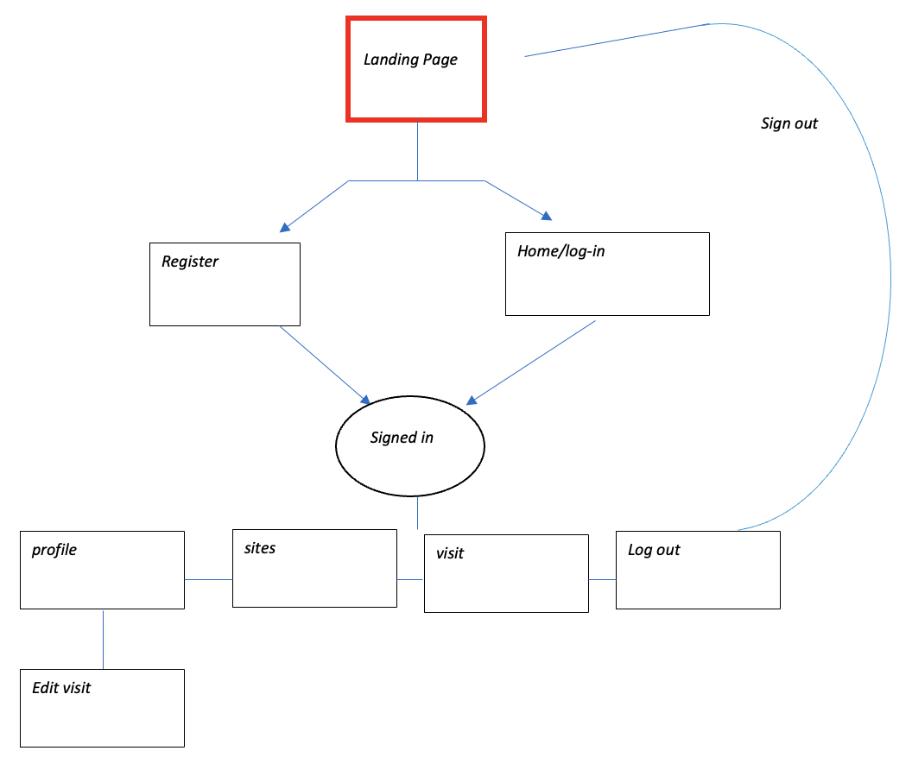
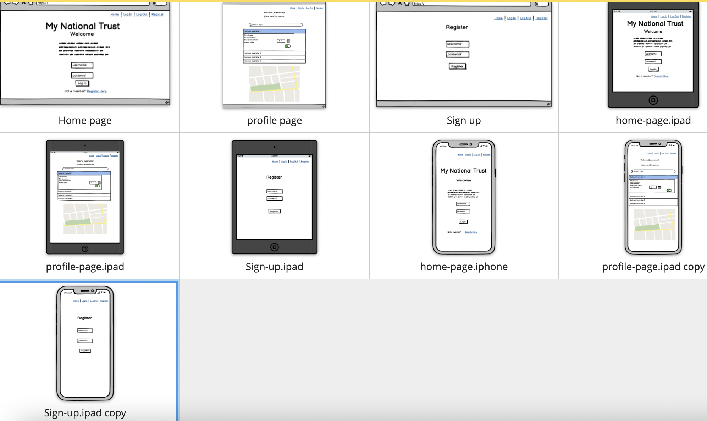
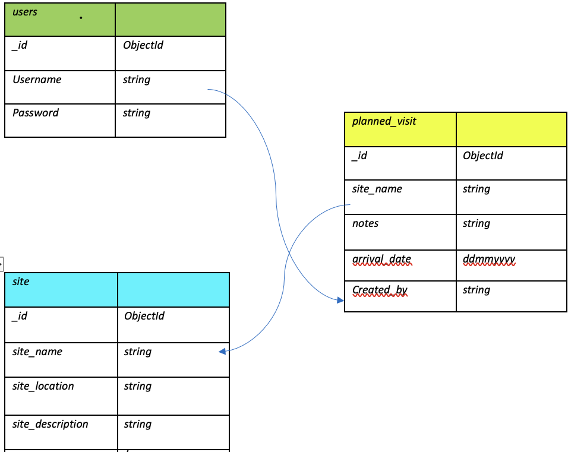

[CI logo](https://codeinstitute.s3.amazonaws.com/fullstack/ci_logo_small.png)

# My National Trust

## [Table of Contents]()
- [Project Goals](#Project-goals)

- [User Stories](#User-Stories)
  - [User Goals](#User-Goals)
  - [Non Registerd User](#Non-Registered-User)
  - [Registered User Goals](#Registered-User-Goals)
  - [Owner Goals](#Owner-Goals)
  - [User Potential](#User-Potential)
  - [This App](#This-App)

- [User Design](#User-Design)
  - [Strategy](#Strategy)
  - [Scope](#Scope)
  - [Future Scope](#Future-Scope)
  - [Structure](#Structure)
  - [Design](#Design)
  - [Color Scheme](#Color-Scheme)
  - [Typography](#Typograpghy)
  - [Imagery](#Imagery)

- [Wireframes](#Wireframes)
- [Data Schema](#Data-Schema)
- [Features](#Features)
  - [Future Features](#Future-Features)
- [Technology Used](#Technology-Used)
  - [Languages](#Languages)
  - [Libraries](#Libraries)
  - [Database Management](#Database-Management)
- [Testing](#Testing)
  - [Code Validation](#Code-Validation)
  - [User Story Testing](#user-stories-testing)
  - [Owner Story Testing](#owner-stories-testing)
  - [Registers User Story Testing](#registered-user-goals-testing)

- [Deployment](#Deployment)
- [Credit](#credits)

## Project Goals
The aim of this app was to deliver a simple and consise planner focused on the National Trust Sites of Northern Ireland. With over 30 sites to visit dotted around beautiful landscapes it would be useful to be able to plan trips and tick them off as you go. 
My National Trust will be responsive on all devices focusing on mobile first design, also ensuring visitors have a unique user experience. 
This app will be aimed at users who are looking to travel to the multiple National Trust sites and want to know information and the location for each site. This can be viewed via the Google Map on the Sites.html page. The users can be locals or tourists from oversees not wanting to miss out on the experiances that can be had. 
All of this readily available information will be displayed clearly and in hierarchy of importance on each page. 
The navigation bar, which allows you to readily access specific information on the site, interactive features, internal website links showing the user further information on specific sites.
## User Stories

### User Goals

* As a user, I want to be able to access the website, regardless of the device I am using.
* As a user, I want my navigation options to be specific to whether I am logged in.
* As a user, I want to be able to easily navigate to other sections of the website regardless of the current section I'm viewing.
* As a user, I want my own personal account to keep a track of my own planned visits.

### Non-Registered User

* Navigate to Sign-Up page to Register an account.

### Registered User Goals
* As a user, log into my account to gain access to the full functionality of the app.
* As a user, I want to be able to the upcoming visits I have planned.
* As a user, I want to readily see the date I have chosen to visit the selcted site.
* As a user I want to be able to Update, Edit and Delete any upcoming visits I have planned. 

### Owner Goals
* Publicity for the attractions and sites that the National Trust has to offer in Northern Ireland. 
* Bigger audience so as many people as possible are aware of what you can do when visiting.
* Advertise some attractions and sites that can be located in Northern Ireland.
* Offer an interactive site that keeps users interested.
* Use interactive methods such as Google Maps so users can ascertain the location of sites of interest.
* The content provided within this app is primarily to ensure users have a consise planner for the multiple sites available to visit. It is not designed to be a one stop site were you can find and contact each site are find an abundance or tourism information.
This websites primary focus is to be an informal, casual app people can visit to plan future trips.

### User Potential
* Potential vistors of Northern Ireland.
* Researchers wanting to know more about the histroic sites. 
* Past visitors of Northern Ireland.
* Residents of Northern Ireland.  

### This app
* Offers a clean, consise and simplistic journey into planning any future trips to National Trust Sites in Northern Ireland.
* Offers a means to use Google Maps in order to find an accurate location for the sites.
* Provides clear, simple information and is fully responsive.

## User Design

### Strategy
* With the main goal for this app to allow users to simply plan future trips to Northern Ireland National Trust sites, 
  aesthetically pleasing and relevant imagery will allow the user to focus on the content, without being distracted. 
  The design of the site needs to complement the content it is delivering. 
* The 'Home' page allows users to read a small consise text box describing the purpose of this app. 
* This website is aimed at users who want to be aware of the experiences the National Trust has to offer in Northern Ireland. 
  There is no pressure to pursue these attractions. Moreover, there are different types of attractions to suit different types of potential users. The Google Map feature allows users to view the sites on an interactive map.
* The weather widget allows users to view the weather for upcoming visits that have been planned. 

### Scope
* Responsive website for any viewing device size.
* Responsive and interactive navigation bar.
* Relevant images showing some sites mentioned on the app and useful information accompanying the attraction.
* Implementation of API's to display information to the user.
* Producing and interactive website with clickable features that allow the user to find further information about the different attractions.
* Internal page links that allow the user to navigate the website efficiently.
* User authentication to enure that users have there own personal planner for upcoming trips.

#### Future Scope
**Potential for future implementation**
* An 'About' section.
* A seciton that allows past visitors to the mentioned sites to leave reviews.
* For the app not to be contained to just Northern Ireland.
* An interactive blog or newsletter.
* The ability for users to 'favourite' the sites they enjoyed most.
* A checklist of sites that have been visited that specific user
* a seperate list for all user visits and another list for a specific users planned visits.

### Structure
* Top level - 
    * Simple title with navigation in header. This will be responsive and across all pages of website.
* Body - 
    * Main elements found here, depicting important information, relavant to the current page user is on.
    * There will be button elements that enable the user to navigate the content easily and simply.
    * Dependent on the page, there will be images with accompanying information for the user to discover.
    * Dependent on the page there will be an interative map with clickable features to allow a user to access more information.
* Footer - 
    * Copyright information stored here.
    * Some internal links may also be added here.
  
* Basic structure of app

  

### Design

#### Color Scheme
* The color of the scheme of the site was decided by using natural green colors that can be easily associated with a Northern Ireland and the National Trust.
* The color of #004d40, complements the main and overall color dervived from the app theme. This color is strong and allows text to be easily read. 
* Where suitable the color black was used for text against a white background, these are contrasting colors that allow the user to easily read the information.
* With a neutral background color, the information depicted would not be too contrasting on the site when loaded.  

#### Typography
* The font utilised for this app was the Montserrat font. Thia font has the serif typeface, therefore Sans Serif will be used as the fallback font in case there is an issue when importing the fonts, or browsers not supporting these. Font was imported via Google Fonts completement the simplicity of the design giving a visually pleasing user experience.

#### Imagery
* Images used purely for some asthetically pleasing design.  
* Font icons will be used throughout the website imported from [Font Awesome](https://fontawesome.com/). 
  These will be used to further emphasise the different sections of the website. 
  Using these icons adds a simple, effective and a subtle touch to the site that allows the user to understand what each section relates to. 
  The icons will be relevant to the different section headings of the site.

# Wireframes
I Used Balsamiq to generate my Wireframes.

# Data Schema
For this project, the NoSQL database MongoDB was used to store the dataset. Within the created database, three collections were created, as shown below:

## Collections

### User collection
* When registering an account the user provides:
  - Username
  - Password

### Sites Collection
* The sites collection consits of:
  - Site name
  - Site location
  - Site description 

### Planned Visits Collection
* The planned visits collection consits of:
  - Site name
  - Notes
  - Arrival
  - Username 

# Features
* Functioning Nav bar with working links.
* Responsive images.
* Functioning interactive google map. 
* Buttons that utilise Jquery for further interactivity.

# Technology Used

### Languages used
* HTML5
* CSS3
* JavaScript
* Python

### Git
* Was used for version control to commit to Git and push to Heroku.

### Heroku 
* Heroku was used in order to deploy the website.

### BeFunky 
  - used for resizing images used.

### National Trust Site 
  - used to source some imagery. Site information and locations.
.
### GitHub.
- to store and display code.

### Libraries
* Materialize 
  * Materialize was used to implement the responsiveness of the site, using their own custom classes.
* jQuery
  * jQuery was used to simplify the JavaScript code used. As recommended by Materialize.
* Google Fonts 
  * Google fonts was used to import the font "Montserrat" into the style.css file. This fonts was used exclusively throughout the development of this project.
* Flask
  * Flask was used as the web framework for the application.
* PyMongo
  * flask_pymongo was used a communication line between the MongoDB database and Python.
* BSON
  * bson.objectid is a required dependency for MongoDB management system. This enables the app to provide a more accurate results from the database.
* Jinja
  * Jinja templating language was used to simplify and display backend data in html with ease.
* Werkzeug
  * Werkzeug was used for password hashing and authentication.

### Database Management
* MongoDB
  * MongoDB was the chosen NoSQL database for this website.
* Mongo Atlas 
  * MongoDB Atlas was the cloud database service used to host the database.

### Weather API 
* Weather widgit code sourced from weatherwidgit.io.

# Testing
* All navigations links tested across all pages, no issues.
* Text fields working correctly.
* All elements of CRUD satisfied. Data can be sent to and from Database with no issues. Data and be read/created/updated and deleted.
* Site fully responsive to all breakpoints.
## Google Lighthouse
* Google Lighthouse report generated a SEO of 93 and accessability of 93. Performace was marked at 93 and best preactices given a grade of 87.
## Functionality Testing
- I used Chrome developer tools throughout the creation and devlopemnt of this site.
## Combatability Testing
-  The site has been tested across multiple virtual mobile devices and browsers. I checked all supported devices in both Mozilla web developer tools and Chrome developer tools. 
### Known bug
-  On collapsible accordion, within the list of sites the site name 'Castle Coole' does not load despite the the site_description loading from MongoDB correctly. 
## Code Validation
- HTML has been passed through W3 Validator with no issues or warnings. 
- CSS has passed through W3 JigSaw validator with no issues. 
- JS - Passed through JSHint with no major issues some warnings to advise certain synatx is available in 'ES6 (use 'esversion: 6')'.
- Python code has been passed through http://pep8online.com/, no concerns or errors.

## User Stories Testing
- As a user, I want to be able to access the website, regardless of the device I am using.
  > The website has been tested across virtual different devices with no issues.

- As a user, I want my navigation options to be specific to whether I am logged in.
  >Navigation options only show profile or visits section when logged in. When logged out only options are home or register.

- As a user, I want to be able to easily navigate to other sections of the website regardless of the current section I'm viewing.
  > Fully responiive navigation bar that allows you to visit any part of the site with ease. Once logged in.

- As a user, I expect all links of the site to be in full working order - and to be able to easily access any social media accounts relative to the company. 
  > All links have been tested and confirmed as working.  

## Owner Stories Testing
- * Publicity for the attractions and sites that the National Trust has to offer in Northern Ireland. 
  > The app is a hub that can be used for potential visitors of Northern Ireland looking to visit a national trust site, 
  > the sites can be located and named from clicking on markers of the google map. There is information on every specific site.

- Bigger audience so as many people as possible are aware of what you can do when visiting.
  > Site has an SEO of 93.

- Use interactive methods such as Google Maps so users can ascertain the location of points of interest.
  > Google Maps API succeefully implemented onto site with clickable markers, the weather widget also allows for users to gauge the weather for thier visit

## Registered User Goals Testing

- As a user, log into my account to gain access to the full functionality of the app.
  > Once logged in all site functions and available to the user. 

- As a user, I want to be able to the upcoming visits I have planned. 
    > All planned visits are available to view via the profile page - the visits that can be edited are the visits created by the user. 

-  As a user, I want to readily see the date I have chosen to visit the selcted site.
  > Each instance of a visit clearly shows the selected arrival date.

- As a user I want to be able to Update, Edit and Delete any upcoming visits I have planned.
  > Users can edit, delete, create or update any visit they have planned.

# Deployment 
* This project was deployed to Heroku. I used Gitpod as a development environment where all changes and updates have been committed to git version control system. I used push command in Gitpod to save changes into GitHub. I connected my GitHub account to Heroku and set up Automatic deployment in Heroku under Deploy section.

- The application is connected to a MongoDB Atlas Cluster. A Project database can be created using the following steps:

  - Log into MongoDB or create an account.
  - Locate and select the New Project button and give your project a name. Navigate to the project page.
  - Locate and select the Create a New Cluster button. Once selected:
  - Choose Shared Cluster.
  - Select your Cloud Provider and Region.
  - Click on Cluster Tier and select tier of preference.
  - Click on Cluster Name and create your cluster.
  - Locate and select Database Access. Once selected, click Add New Database User:
  - Choose Password for the Authentication Method
  - Enter a username and password
  - Ensure Read and write to any database is selected in Database User Privileges
  - Add User
  - Locate and select Network Access under Database Access. Once selected, click Add IP Address:
  - Select Allow Access from anywhere.
  - Select Confirm.
  - Locate and select Clusters.
  - Click Collections, then Create Database to start adding documents to your database collections:
  - Enter chosen Database Name
  - Enter chosen Collection Name
  - Select Create
  - Click Create Collection and create the necessary collections.

### How to run this project locally:

- Install the GitPod Browser Extension for Chrome.
- After installation, restart the browser.
- Log into GitHub or create an account.
- Locate the GitHub Repository.
- Click the "GitPod" button. This will trigger a new gitPod workspace to be created from the code in github where you can work locally.

### How to run this project within a local IDE, such as VSCode:

  - Log into GitHub or create an account.
  - Locate the GitHub Repository.
  - Under the repository name, click "Clone or download".
  - In the Clone with HTTPs section, copy the clone URL for the repository.
  - In your local IDE open the terminal.
  - Change the current working directory to the location where you want the cloned directory to be made.
  - Type 'git clone', and then paste the URL you have copied.
git clone https://github.com/USERNAME/REPOSITORY
Press Enter. Your local clone will be created.
(Further reading and troubleshooting on cloning a repository from GitHub here)

# Credit
* To complete this project I used the Code Institute student template: gitpod full template
* Ideas and knowledge library:
  - w3schools.com
  - css-tricks.com
  - Materialize was used for styling
  - Tim Nelson with The Code Instute & the Task Planner app for user authentication python code. 

